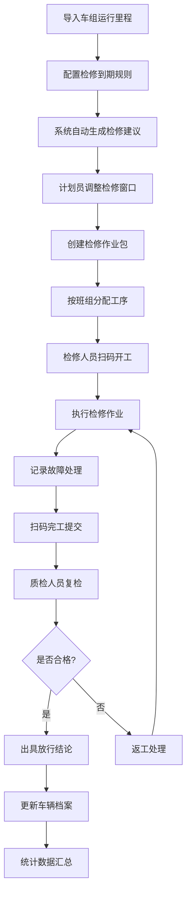

## 1. 产品概述

动车组检修计划 Web 应用是供动车所计划员、检修班组和质检人员协同使用的一体化检修管理平台。系统通过数字化手段优化检修流程，提升检修效率，确保动车组运行安全。

- **核心目标**：实现检修计划智能生成、作业流程可视化追踪、质量全流程管控、数据统计分析
- **目标用户**：动车所计划员、检修班组人员、质量验收人员
- **产品价值**：提升检修计划合理性、减少人为失误、缩短检修周期、降低运营成本

## 2. 核心功能

### 2.1 用户角色

| 角色 | 核心权限 |
|------|----------|
| 计划员 | 制定检修计划、导入运行里程、配置到期规则、分配工序、查看统计报表 |
| 检修班组 | 查看派工任务、扫码开工完工、记录故障处理、领用物料 |
| 质检人员 | 质量验收、记录复检意见、出具放行结论、抽查检修质量 |

### 2.2 功能模块

1. **检修日历**：月度检修计划展示、自动生成一二级修建议、手动调整检修窗口、超期风险提醒
2. **车辆档案**：车组基本信息、运行里程记录、检修历史、关键配件寿命追踪
3. **作业包**：检修工序定义、作业标准配置、工时定额管理、故障处理指南
4. **派工看板**：按班组分配工序、实时任务状态追踪、人员负荷可视化展示
5. **质量验收**：扫码确认开工完工、故障处理记录、复检意见录入、放行结论判定
6. **物料领用**：关键配件消耗追踪、库存预警、领用记录查询
7. **统计报表**：按车组/班组/故障类型汇总、效率分析、返工率统计

### 2.3 页面详情

| 页面名称 | 模块名称 | 功能描述 |
|-----------|-------------|---------------------|
| 检修日历 | 日历视图 | 月度车组检修计划展示，不同颜色区分检修等级和状态 |
| 检修日历 | 智能建议 | 导入运行里程和到期规则后自动生成一二级修建议 |
| 检修日历 | 窗口调整 | 拖拽调整检修窗口时间，冲突检测与提醒 |
| 检修日历 | 风险预警 | 超期未修车辆高亮提醒，临近到期预警 |
| 车辆档案 | 车组列表 | 全部动车组清单，支持按车型、状态筛选 |
| 车辆档案 | 详情面板 | 车组基本信息、累计里程、下次检修时间 |
| 车辆档案 | 检修历史 | 历次检修记录，包含检修时间、等级、故障处理情况 |
| 车辆档案 | 配件追踪 | 关键配件安装时间、寿命周期、更换记录 |
| 作业包 | 工序管理 | 一二级修标准工序库，支持自定义配置 |
| 作业包 | 作业标准 | 每项工序的作业指导书、质量标准、安全注意事项 |
| 派工看板 | 班组看板 | 按检修班组展示当日/当周任务分配 |
| 派工看板 | 人员负荷 | 人员任务分配甘特图，负荷过载预警 |
| 派工看板 | 任务状态 | 待分配/进行中/已完成状态实时更新 |
| 质量验收 | 作业确认 | 扫码开工、扫码完工，记录作业时长 |
| 质量验收 | 故障记录 | 故障描述、处理措施、更换配件登记 |
| 质量验收 | 复检验收 | 质检人员复检意见、合格/返工判定 |
| 质量验收 | 放行结论 | 最终检修质量判定、签字确认 |
| 物料领用 | 配件库存 | 关键配件库存数量、安全库存预警 |
| 物料领用 | 领用登记 | 检修任务关联的配件领用记录 |
| 物料领用 | 消耗追踪 | 按车组/检修批次统计配件消耗 |
| 统计报表 | 效率分析 | 各班组检修效率、平均作业时长对比 |
| 统计报表 | 质量分析 | 返工率统计、故障类型分布、常见问题汇总 |
| 统计报表 | 车组档案 | 单车组检修次数、故障率、运行可靠性分析 |

## 3. 核心流程

## 4. 用户界面设计

### 4.1 设计风格

- **设计定位**：工业级专业系统，注重功能性与可靠性
- **主色调**：深蓝色 (#165DFF) - 代表专业、可靠、科技感
- **辅助色**：
  - 成功绿 (#00B42A) - 检修完成、合格
  - 警告橙 (#FF7D00) - 临近到期、进行中
  - 危险红 (#F53F3F) - 超期、故障、返工
  - 信息蓝 (#4080FF) - 一级修
  - 紫色 (#722ED1) - 二级修
- **中性色**：深灰 (#1D2129)、中灰 (#4E5969)、浅灰 (#86909C)、极浅灰 (#F2F3F5)
- **按钮风格**：直角微圆角 (4px)，强调专业感，悬停有轻微阴影
- **字体**：
  - 标题："Noto Sans SC"，字重 600
  - 正文："Noto Sans SC"，字重 400
  - 数据数字："JetBrains Mono"，等宽字体便于数据对比
- **布局风格**：顶部导航 + 左侧菜单 + 主内容区，经典企业级应用布局
- **图标风格**：线性图标，简洁明了，使用 Lucide 图标库

### 4.2 页面设计概览

| 页面名称 | 模块名称 | UI 元素 |
|-----------|-------------|----------|
| 检修日历 | 日历视图 | 大型月历网格，色块标记检修计划，悬停显示详情卡片 |
| 车辆档案 | 列表+详情 | 左侧车组列表，右侧详情面板，标签页切换信息类别 |
| 派工看板 | 看板视图 | 多列看板布局（待分配/进行中/已完成），卡片拖拽交互 |
| 质量验收 | 流程卡片 | 步骤条展示验收流程，扫码区域大按钮突出 |
| 统计报表 | 图表组合 | 柱状图、折线图、饼图组合展示，支持多维度筛选 |

### 4.3 响应式设计

- **Desktop-first**：以 1920x1080 为主要设计尺寸
- **平板适配**：≥1280px，侧边栏可收起，内容区自适应
- **移动端**：≥768px，简化布局，优先展示核心功能
- **触控优化**：按钮最小尺寸 44x44px，列表项间距适中

### 4.4 动效设计

- 页面切换：淡入淡出过渡，200ms 缓动
- 数据加载：骨架屏占位，内容渐入
- 看板拖拽：卡片提升阴影 + 位置平滑过渡
- 状态变化：数字滚动动画，进度条平滑增长
- 风险提醒：呼吸灯效果吸引注意
