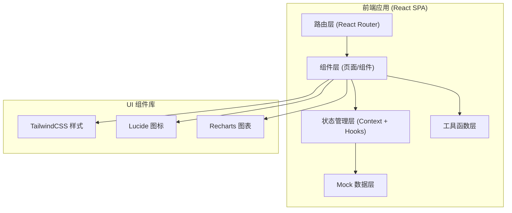
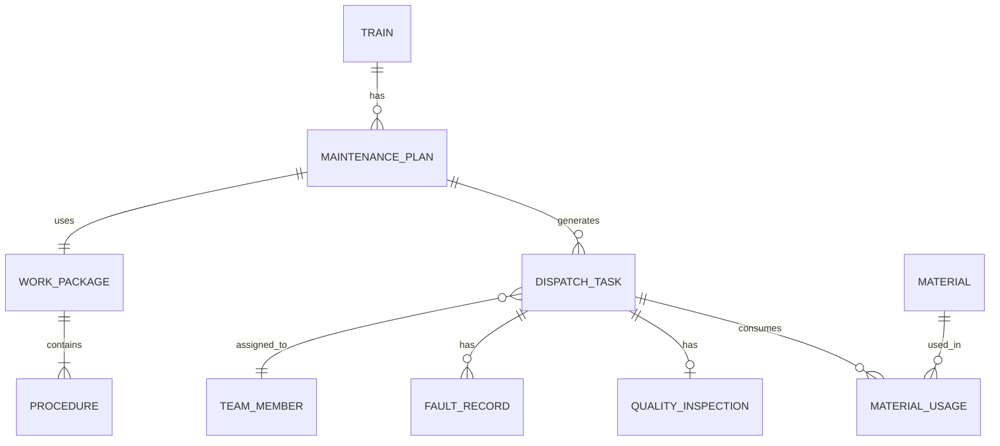

## 1. 架构设计



## 2. 技术选型说明

| 技术 | 版本 | 用途说明 |
|------|------|----------|
| React | 18 | 前端核心框架，使用 Hooks 进行状态管理 |
| TypeScript | 5.x | 类型安全，提升代码可维护性 |
| Vite | 5.x | 构建工具，提供快速开发体验 |
| TailwindCSS | 3.x | 原子化 CSS 框架，快速构建界面 |
| React Router | 6.x | 单页应用路由管理 |
| Lucide React | latest | 线性图标库 |
| Recharts | 2.x | 图表库，用于统计报表 |
| date-fns | latest | 日期处理工具库 |

## 3. 路由定义

| 路由路径 | 页面名称 | 说明 |
|----------|----------|------|
| / | 检修日历 | 系统首页，月度检修计划展示 |
| /calendar | 检修日历 | 检修计划管理、智能建议、窗口调整 |
| /trains | 车辆档案 | 动车组信息管理、检修历史查询 |
| /work-packages | 作业包 | 工序管理、作业标准配置 |
| /dispatch | 派工看板 | 任务分配、人员负荷展示 |
| /quality | 质量验收 | 扫码确认、故障记录、放行判定 |
| /materials | 物料领用 | 配件库存、领用登记、消耗追踪 |
| /reports | 统计报表 | 多维度数据分析 |

## 4. 数据模型定义

### 4.1 核心数据类型

```typescript
// 动车组信息
interface Train {
  id: string;
  trainNo: string;      // 车组编号，如 CRH380A-001
  model: string;        // 车型
  manufactureDate: string;
  totalMileage: number; // 累计运行里程(km)
  lastMaintenanceDate: string;
  nextMaintenanceLevel: 'level1' | 'level2';
  nextMaintenanceDate: string;
  status: 'running' | 'maintenance' | 'idle' | 'overdue';
}

// 检修计划
interface MaintenancePlan {
  id: string;
  trainId: string;
  trainNo: string;
  level: 'level1' | 'level2';
  plannedStartDate: string;
  plannedEndDate: string;
  actualStartDate?: string;
  actualEndDate?: string;
  status: 'planned' | 'in_progress' | 'completed' | 'overdue';
  workPackageId: string;
  assignedTeam?: string;
}

// 作业包
interface WorkPackage {
  id: string;
  name: string;
  level: 'level1' | 'level2';
  description: string;
  estimatedHours: number;
  procedures: Procedure[];
}

// 工序
interface Procedure {
  id: string;
  name: string;
  description: string;
  standardTime: number; // 标准工时(分钟)
  requiredSkill: string;
  safetyNotes?: string;
  qualityStandard?: string;
}

// 派工任务
interface DispatchTask {
  id: string;
  planId: string;
  procedureId: string;
  procedureName: string;
  trainNo: string;
  teamId: string;
  teamName: string;
  assigneeId?: string;
  assigneeName?: string;
  status: 'pending' | 'assigned' | 'in_progress' | 'completed' | 'rework';
  startTime?: string;
  endTime?: string;
  actualDuration?: number;
}

// 班组人员
interface TeamMember {
  id: string;
  name: string;
  teamId: string;
  teamName: string;
  skills: string[];
  workload: number; // 当前负荷百分比
}

// 故障记录
interface FaultRecord {
  id: string;
  taskId: string;
  trainId: string;
  description: string;
  faultType: string;
  severity: 'minor' | 'major' | 'critical';
  handlingMeasures: string;
  replacedParts?: string[];
  handler: string;
  handleTime: string;
}

// 质量验收
interface QualityInspection {
  id: string;
  taskId: string;
  planId: string;
  inspector: string;
  inspectionTime: string;
  result: 'pass' | 'fail' | 'rework';
  remarks?: string;
  reworkRequired?: boolean;
  releaseConclusion?: 'released' | 'held';
}

// 物料配件
interface Material {
  id: string;
  name: string;
  partNo: string;
  category: string;
  stockQuantity: number;
  safeStock: number;
  unit: string;
}

// 领用记录
interface MaterialUsage {
  id: string;
  materialId: string;
  materialName: string;
  taskId: string;
  planId: string;
  trainNo: string;
  quantity: number;
  receiver: string;
  receiveTime: string;
}

// 检修到期规则
interface MaintenanceRule {
  level: 'level1' | 'level2';
  mileageThreshold: number; // 里程阈值(km)
  timeThreshold: number;    // 时间阈值(天)
  description: string;
}
```

### 4.2 数据关系图



## 5. 项目目录结构

```
src/
├── assets/              # 静态资源
├── components/          # 公共组件
│   ├── layout/         # 布局组件
│   ├── ui/             # 基础 UI 组件
│   └── charts/         # 图表组件
├── pages/              # 页面组件
│   ├── Calendar/       # 检修日历
│   ├── Trains/         # 车辆档案
│   ├── WorkPackages/   # 作业包
│   ├── Dispatch/       # 派工看板
│   ├── Quality/        # 质量验收
│   ├── Materials/      # 物料领用
│   └── Reports/        # 统计报表
├── hooks/              # 自定义 Hooks
├── types/              # TypeScript 类型定义
├── data/               # Mock 数据
├── utils/              # 工具函数
├── context/            # React Context
├── App.tsx
├── main.tsx
└── index.css
```

## 6. 核心功能实现方案

### 6.1 智能检修建议生成算法
- 输入：车组累计里程、上次检修日期、检修规则配置
- 算法：
  1. 计算距离上次检修的天数和里程增量
  2. 分别与一级修、二级修的阈值比较
  3. 按"先到为准"原则确定下次检修等级和日期
  4. 标记临近到期（7天内）和超期车辆

### 6.2 人员负荷计算
- 统计每个人员当前分配的任务总工时
- 与标准日工作时长（8小时）比较得出负荷百分比
- 负荷 > 100% 标红预警，80%-100% 标黄提醒

### 6.3 扫码功能（模拟实现）
- 提供手动输入任务编号的输入框
- "扫码"按钮点击后模拟扫码成功
- 自动获取任务详情并更新状态

### 6.4 统计报表数据聚合
- 使用数组 reduce 方法进行多维度数据汇总
- 按日期/班组/车组/故障类型等维度分组
- 计算平均时长、返工率等关键指标
